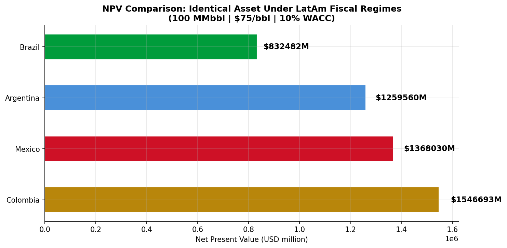
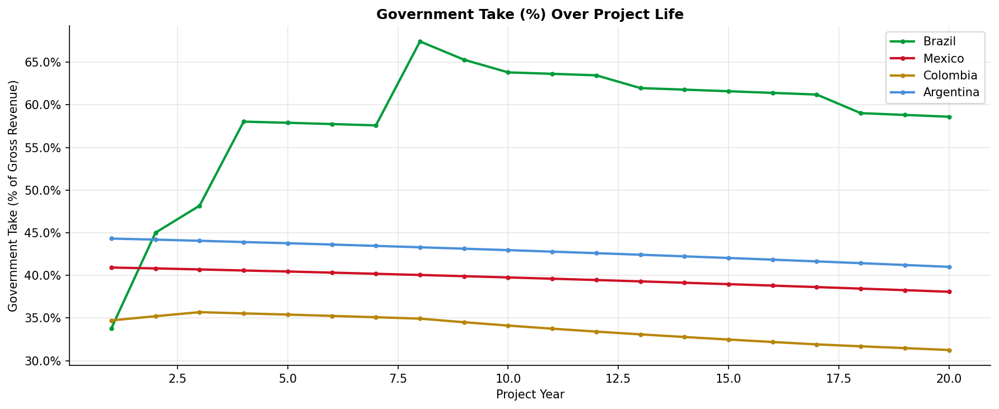
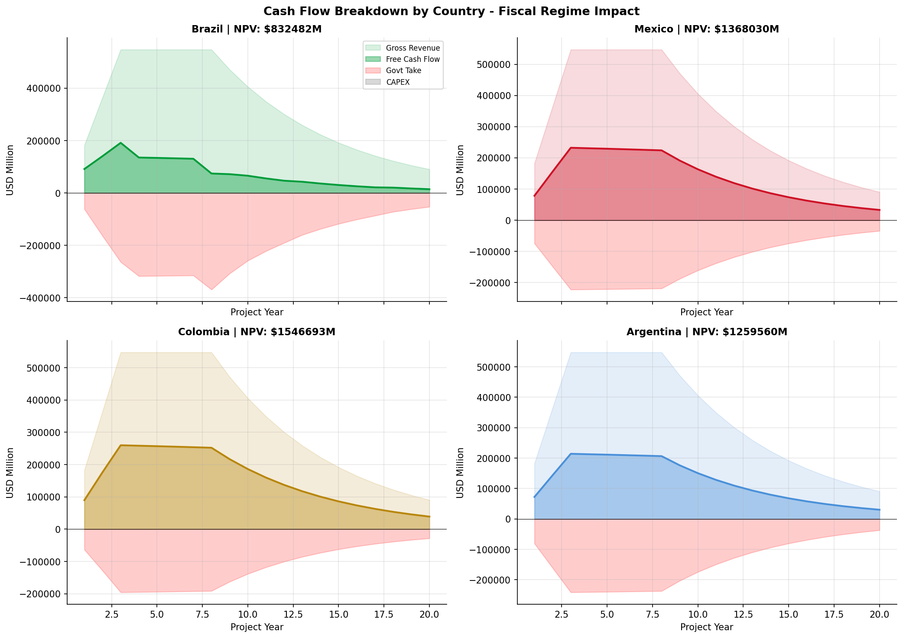
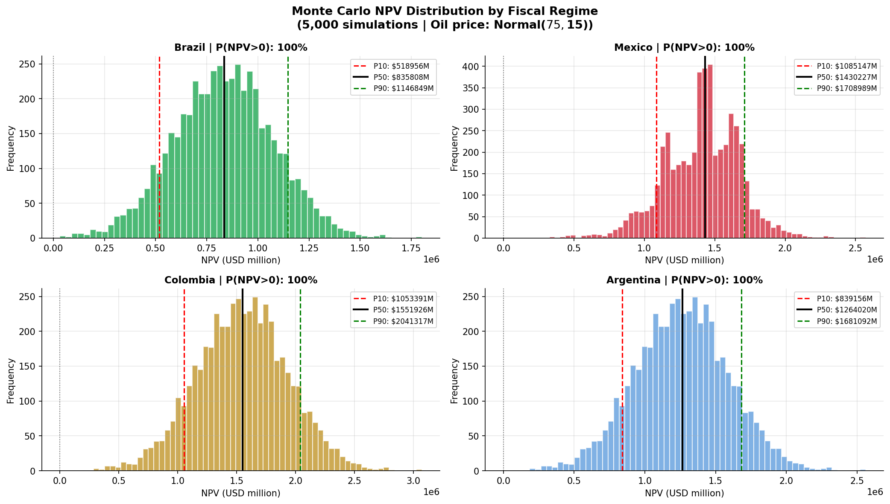

# LatAm Oil Field Valuation: Fiscal Regime & DCF Model

[](https://www.python.org/)
[](LICENSE)

**How do differences in fiscal regimes across Latin American oil-producing countries affect the NPV of an identical upstream asset?**

This project builds a full **Discounted Cash Flow (DCF) model** for a standardized 100 MMbbl oil field, incorporating the principal fiscal instruments of Brazil, Mexico, Colombia, and Argentina. A Monte Carlo simulation over 5,000 oil price scenarios quantifies the P10/P50/P90 NPV distribution under each jurisdiction.

---

## Key Finding

> **Fiscal regime alone creates a spread of ~$714M NPV on an identical upstream asset** — equivalent to approximately 46% difference between the most and least attractive jurisdiction at $75/bbl Brent. Brazil's progressive *Participação Especial* generates the highest government take (peaking at 67% in year 8), making it the least attractive regime for large-field investors despite being the most protective of government revenue. Colombia ranked first under base case assumptions, though this result does not fully capture the 2022 windfall tax reform (see Limitations).

---

## Results

| Country | NPV @ $75/bbl | Avg Govt Take | P50 NPV | P(NPV > 0) |
|---|---|---|---|---|
| Colombia | $1,547M | ~35% | $1,552M | 100% |
| Mexico | $1,368M | ~40% | $1,430M | 100% |
| Argentina | $1,260M | ~43% | $1,264M | 100% |
| Brazil | $832M | ~61% | $836M | 100% |

---

## Fiscal Regimes Modeled

| Country | Regime | Key Instruments | Legislative Basis |
|---|---|---|---|
| 🇧🇷 Brazil | Concession | ANP Royalties (5–15%) + Participação Especial (10–40%) + CSLL/IRPJ (34%) | Lei 9.478/1997 |
| 🇲🇽 Mexico | License (post-2014 reform) | CNH Royalties price-indexed (7.5–27.5%) + ISR (30%) | Ley de Hidrocarburos 2014 |
| 🇨🇴 Colombia | Concession | ANH Royalties (8–25% sliding) + Income Tax (35%) | ANH Reglamento 2012 |
| 🇦🇷 Argentina | Concession | Royalties (15%) + Export Tax / retenciones (8%) + Income Tax (35%) | Ley 17.319 + Decreto 1277/2012 |

---

## Visual Results

| NPV Comparison | Government Take Over Time |
|---|---|
|  |  |

| Cash Flow Waterfall | Monte Carlo Distribution |
|---|---|
|  |  |

---

## Model Structure

```
Production Profile (Ramp → Plateau → Decline)
            │
            ▼
    Gross Revenue (Price × Volume)
            │
            ├──► Royalties (country-specific sliding scale)
            ├──► Special Participation / Profit Oil (Brazil)
            ├──► Export Taxes / retenciones (Argentina)
            ├──► Income Tax (country-specific rate)
            ├──► OPEX (inflation-adjusted at 2.5%/year)
            └──► CAPEX (front-loaded, years 1–4)
                        │
                        ▼
               Free Cash Flow → DCF (10% WACC) → NPV
                        │
                        ▼
            Monte Carlo (5,000 oil price scenarios)
            Oil price ~ Normal($75, $15), clipped [$20, $150]
               → P10 / P50 / P90 NPV distribution
```

---

## Key Insight: Brazil's Participação Especial

The most analytically interesting result is Brazil's last-place ranking. The *Participação Especial* (PE) is a progressive surcharge applied within the **concession regime** (not the production sharing regime) that kicks in when cumulative production crosses volume thresholds. For a 100 MMbbl field:

- Government take peaks at **67%** in year 8 — exactly when the field is most productive
- This creates a structural disincentive for large-field investment under the concession regime
- By contrast, Brazil's pre-salt **production sharing regime** (Lei 12.351/2010) uses a different instrument — the *excedente em óleo* (profit oil split) — which has a different incidence logic

This distinction between PE (concession) and profit oil (PSC) is a key nuance in Brazilian petroleum fiscal analysis that is frequently overlooked in cross-country comparisons.

---

## Limitations & Caveats

This model is designed for **illustrative and comparative purposes** and incorporates the principal fiscal instruments based on legislation in force through 2024. Users should be aware of the following:

**Brazil:** The model assumes the concession regime (Lei 9.478/1997). Brazil's pre-salt fields operate under the production sharing regime (Lei 12.351/2010), with different fiscal logic. A 100 MMbbl field in the Santos Basin pre-salt would require a separate PSC model.

**Mexico:** The model uses the fiscal terms of the 2014 Ley de Hidrocarburos. In March 2025, Mexico enacted a new Hydrocarbons Sector Law (LSH) that restructured the regulatory framework, extinguished the CNH, and reassigned regulatory authority to SENER and the new National Energy Commission (CNE). The fiscal implications for existing contracts are still evolving.

**Colombia:** The 2022 tax reform (Reforma Tributaria para la Igualdad y la Justicia Social) introduced two significant changes not captured in the base model: (1) suppression of royalty deductibility for income tax purposes, and (2) a windfall surcharge of 5–15% on oil producers when the current-year average price exceeds the 120-month historical average. Including these would increase Colombia's government take and reduce its NPV advantage.

**Argentina:** Provincial royalty rates vary significantly across producing provinces (Neuquén, Santa Cruz, Chubut). The model uses a blended 15% rate (12% federal + 3% provincial average). Export tax (*retenciones*) rates have historically been volatile and subject to policy changes.

---

## Reproducing the Results

```bash
# 1. Clone
git clone https://github.com/victorcampos-reis23/latam-oil-dcf.git
cd latam-oil-dcf

# 2. Install dependencies
pip install -r requirements.txt

# 3. Create outputs folder
mkdir outputs

# 4. Run
jupyter notebook notebooks/latam_oil_dcf_valuation.ipynb
```

---

## Project Structure

```
latam-oil-dcf/
├── notebooks/
│   └── latam_oil_dcf_valuation.ipynb
├── outputs/
│   ├── fig1_production_profile.png
│   ├── fig2_npv_comparison.png
│   ├── fig3_cashflow_waterfall.png
│   ├── fig4_govt_take.png
│   ├── fig5_monte_carlo_npv.png
│   └── latam_fiscal_comparison.csv
├── requirements.txt
└── README.md
```

---

## Motivation

During my interview process at S&P Global Commodity Insights, the conversation with the technical research team highlighted the importance of incorporating **jurisdiction-specific fiscal legislation** into upstream asset valuation — a key challenge for platforms serving E&P investment decisions. This project demonstrates that approach directly.

This work connects to my broader research on geopolitical risk and energy firm performance:
- [brazil-oil-transmission](https://github.com/victorcampos-reis23/brazil_oil_transmission) — TVP-VAR analysis of oil price shock transmission in Brazil
- [geopolitics-pimes](https://github.com/victorcampos-reis23/geopolitics-pimes) — 2SLS identification of geopolitical shocks on Brazilian energy firm EBITDA

---

## References

- ANP (2023). *Regulamento do Processo de Concessão*. Agência Nacional do Petróleo, Brasil.
- CNH (2022). *Contratos de Licencia y Producción Compartida*. Comisión Nacional de Hidrocarburos, México.
- ANH (2012). *Reglamento Operativo de Contratos E&P*. Agência Nacional de Hidrocarburos, Colombia.
- S&P Global Commodity Insights (2022). *Colombia Tax Reform Impact on Upstream Assets*. Vantage Platform Analysis.
- Johnston, D. (2003). *International Exploration Economics, Risk, and Contract Analysis*. PennWell Books.
- Kaiser, M.J. & Pulsipher, A.G. (2004). Fiscal system analysis: Concessionary and contractual systems. *Energy*, 29(10).

---

**Author:** Victor Hugo Campos Reis Alves
M.Sc. Economics — UFPE/PIMES | [LinkedIn](https://linkedin.com/in/victor-hugo-campos) | [GitHub](https://github.com/victorcampos-reis23)
